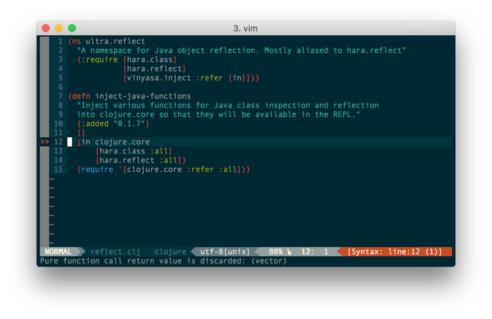

# vim-eastwood


vim-eastwood is a vim plugin for [Eastwood](https://github.com/jonase/eastwood/), the Clojure lint tool. It extends [Syntastic](https://github.com/scrooloose/syntastic)'s checkers, so you'll see those familiar markers in your UI:



## Installation

### Requirements

You'll want to have [Eastwood](https://github.com/jonase/eastwood/), [vim-fireplace](https://github.com/tpope/vim-fireplace/) and [Syntastic](https://github.com/scrooloose/syntastic) installed, and you'll need to make sure Eastwood is somewhere on the Leiningen classpath. 

In order for Syntastic to actually try to lint the file you're working on, you'll also need to have a REPL connection open through fireplace.

After that, the rest should take care of itself.

### Installing vim-eastwood with Pathogen

Assuming you already have [Pathogen](https://github.com/tpope/vim-pathogen) installed, you should be good to go with the following:

```
cd ~/.vim/bundle && \
git clone https://github.com/scrooloose/syntasÂtic.git
```

### Installing vim-eastwood with Vundle

To install vim-eastwood with [Vundle](https://github.com/gmarik/Vundle.vim), add the following line to your `.vimrc`:
```
Bundle 'venantius/vim-eastwood'
```

## License

Copyright (c) W. David Jarvis.

Licensed under the Eclipse Public License, the same as Clojure.
